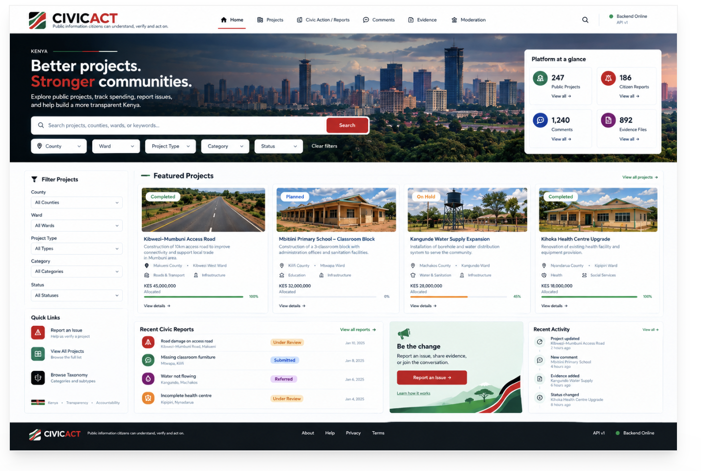

# Citizen Intelligence Layer

A citizen-first platform for understanding public projects, budgets, expenditure,
contracts, evidence, and civic action.

## Frontend

The frontend is a Next.js application that presents public project information
and evidence in a citizen-friendly interface.




Run the frontend locally:

```bash
cd frontend
npm run dev
```

Open <http://localhost:3000>.

See the complete frontend guide in [frontend/README.md](../frontend/README.md).

## Backend

The backend is an asynchronous FastAPI service with SQLModel persistence,
PostgreSQL, Redis, Celery, RabbitMQ, and Alembic migrations.

The API exposes project records with:

- Location and project details
- Allocated, contracted, and spent amounts
- Contractor and progress information
- Verification status
- Source and claim provenance
- Evidence-grounded review flags
- Citizen issue reports

Run the complete stack:

```bash
docker compose up --build
```

Useful endpoints:

- Frontend: <http://localhost:3000>
- API documentation: <http://localhost:8000/docs>
- API health: <http://localhost:8000/health>
- Project list: <http://localhost:8000/api/v1/projects>

See the complete backend guide in [backend/README.md](../backend/README.md).

## Adding screenshots

Store frontend screenshots and backend/API screenshots in this directory or in
`frontend/public/`, then reference them with repository-relative Markdown:

```markdown


```

Keep image files small and use descriptive names. Screenshots should not include
real credentials, personal information, or private API data.

## Evidence principle

Every material claim should remain traceable to its source record. Derived
review flags are signals for verification, not accusations, and AI explanations
must never replace the underlying evidence.
